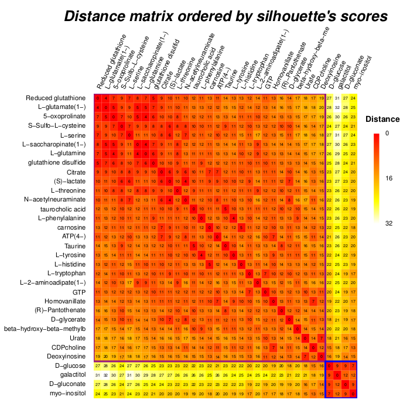
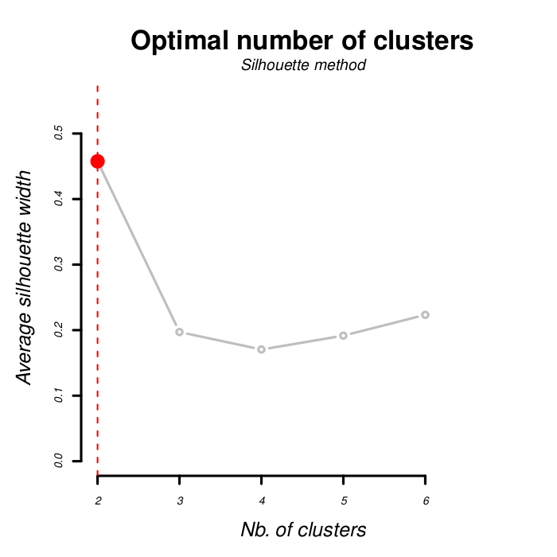
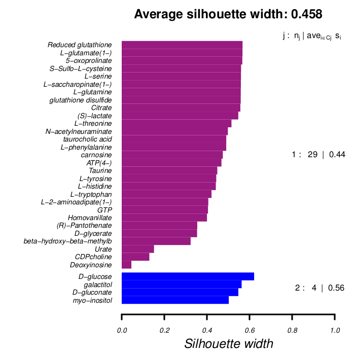
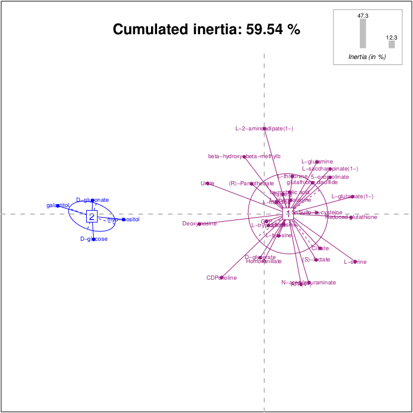
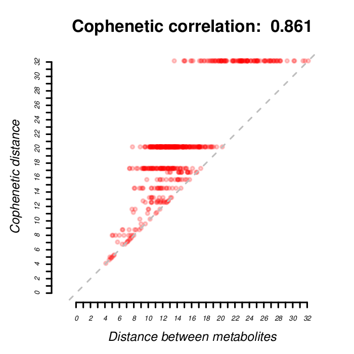
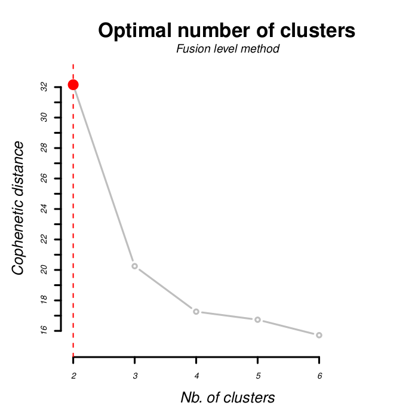
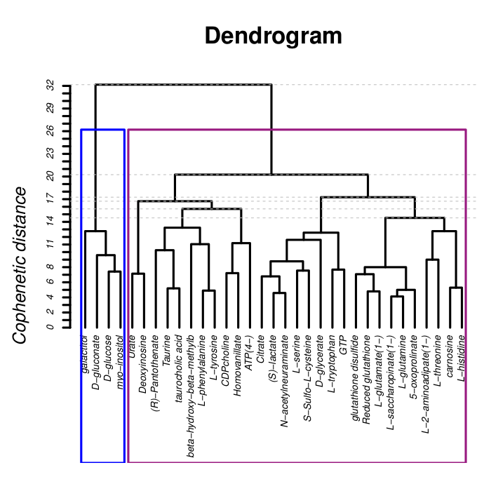
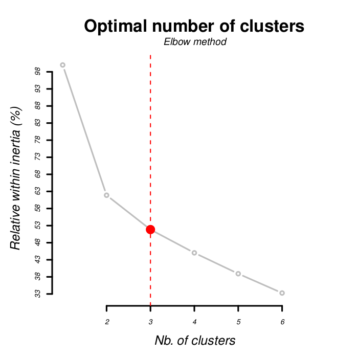
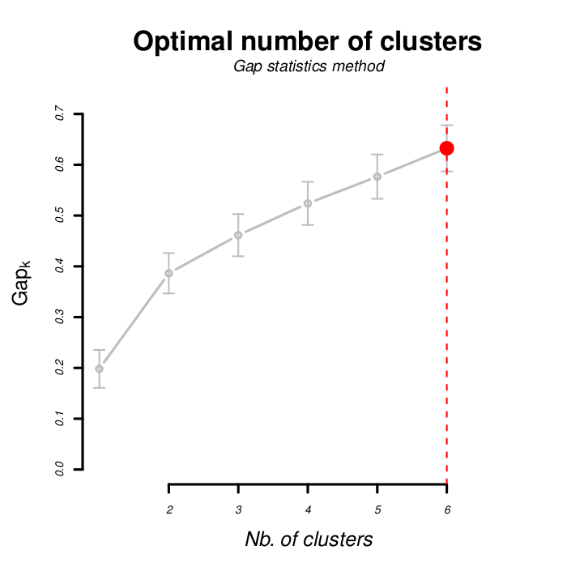
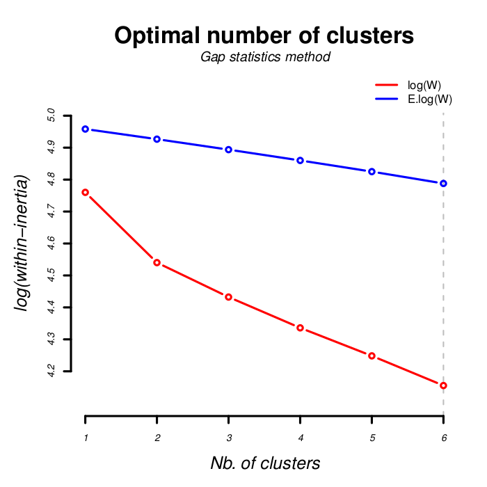

```{r, include = FALSE}
knitr::opts_chunk$set(
  collapse = TRUE,
  comment = "#>",
  fig.path = "man/figures/README-",
  out.width = "100%"
)
```

# [GimmeMyCluster] - Automatic clustering

##### Version: 
```{r, echo=FALSE, results='asis'}
cat(golem::get_golem_version())
```

##### Author: Etienne CAMENEN (INSERM)

##### Short description:
Performs unsupervised clustering and automatically determines the optimal number of clusters using the Silhouette index. It provides various visualizations to aid in the interpretation and validation of cluster analysis.

##### Server: https://ecamenen.shinyapps.io/GimmeMyCluster/

##### EDAM operation:
- Classification
- Clustering
- Visualisation

##### Key-words:
- Dendrogram
- Heatmap
- Model selection
- Silhouette
- Unsupervised clustering

## Contents
* [Description](#description)
    * [Input files](#input-files)
    * [Output files](#output-files)
        * [Default mode](#default-mode)
        * [Agglomerative hierachical clustering mode (by default)](#agglomerative-hierachical-clustering-mode--by-default-)
        * [Advanced mode](#advanced-mode)
* [Installation](#installation)
    * [Windows & Mac](#windows--mac)
    * [Linux](#linux)
* [Launch the app](#launch-the-app)
* [Command line interface](#command-line-interface)
  * [Execution parameters](#execution-parameters)
  * [Files parameters](#files-parameters)
  * [Clustering parameters](#clustering-parameters)
* [References](#references)

## Description
Unsupervised algorithm designed to classify individuals into an optimal number of clusters. The optimal number of clusters is determined automatically using the Silhouette index (Rousseeuw, 1987). This index evaluates the quality of the clustering based on the average distance of a point to other points within its cluster and the average distance to points in the nearest cluster. The Silhouette index ranges from -1 to 1, where higher values indicate better-defined clusters. The best partition is determined by the minimum average silhouette width.

### Input files
- A `matrix` (csv or tsv): The first column should contain the individuals' names, and the other columns should contain the variables. Columns with character values (except the first one) will be discarded from the analysis. "NA" values are not tolerated by the algorithms. An example dataset can be downloaded [here](inst/extdata/matrix.txt).

|Metabolites|GTP|L-serine|ATP(4-)|...|
|-------------|-----|----------|---------|-----|
|S1|0|4|4|...|
|S2|4|0|4|...|
|S3|4|4|0|...|
|...|...|...|...|...|

### Output files

##### Default mode

- ```heatmap.pdf``` : distance matrix between individuals colored by a gradient (from minimal distance in red to maximum distance in white). In hierarchical clustering, individuals are ranked according to the dendrogram result. In partitioning clustering (or advanced mode), they are ordered by the Silhouette score.

- ```average_silhouette.pdf``` : optimal number of clusters according to the average Silhouette's index (x: number of clusters; y: average silhouette width).

- ```silhouette.pdf``` : for the optimal number of clusters (determined above), the Silhouette's index for each individuals and for each cluster.

- ```pca.pdf``` : individuals' projection on the first two PCA axes. Individuals are colorized according to their cluster membership. Each cluster is represented by a centroid and an elliptical dispersion.

- ```summary.tsv``` : for each partitioning, the between- and within-inertia, the between-inertia differences with the previous partition, and the average silhouette width.

Nb. clusters | Between-inertia (%) | Between-differences (%) | Within-inertia (%) | Silhouette index | Gap | Gap SE
------------ | ------------------- | ----------------------- | ------------------ | ---------------- | --- | ------
2 | 38.11 | 38.11 | 61.88 | 0.45 | 0.38 | 0.039
3 | 48.15 | 10.03 | 51.84 | 0.19 | 0.46 | 0.041

- ```clusters.tsv``` : for each individual, the name (ranked by Silhouette score), the numerical identifier of their cluster, their PCA coordinates on the first two axes, and their Silhouette index.

Metabolites | Cluster | Silhouette | Axis1 | Axis2
----------- | ------- | ---------- | ----- | -----
S1 | 1 | 0.56 | 4.60 | -0.17
S2 | 1 | 0.56 | 4.67 | 0.92
S3 | 2 | 0.62 | -9.03 | -1.34
|...|...|...|...|...|


##### Agglomerative hierachical clustering mode (by default)

- ```shepard_graph.pdf``` : correlation between the distance matrix and the agglomerative metric used by the AHC. The squared correlation is the % of variance of the model. This index is always the best for UPGMA and the worst for Ward.

- ```fusion_levels.pdf``` : differences in branch height with the next agglomeration step. The optimal number of clusters should be the largest one.

- ```dendrogram.pdf``` : agglomerative tree for all paired combinations and the colored chosen clusters.


##### Advanced mode

- ```elbow.pdf``` : optimal number of clusters according to the between inertia loss per partition (x: number of clusters; y: relative within inertia).

- ```gap_statistics.pdf``` : best clustering according to the gap statistics (x: number of clusters; y: within inertia gap). The optimal number of clusters is the greater gap statistic in comparison to the gap statistics from the next partitioning and its standard deviation (Tibshirani et al., 2001).

- ```log_w_diff.pdf``` : differences between the within-inertia log from the dataset and from a random bootstrap, also called gap statistics.

- ```contribution.tsv``` : contribution of each column to the inertia of each cluster for the optimal partitioning.
- ```discriminant_power.tsv``` : contribution of each column to the inertia of each partitioning.
- ```within.tsv``` : within-inertia of each cluster for each partitioning.

Nb. clusters | Cluster 1 | Cluster 2 | Cluster 3
------------ | --------- | --------- | ---------
2 | 0.12 | 0.87 |
3 | 0.21 | 0.08 | 0.69

## Installation
Required: R (≥ 3.3.0)

### Windows & Mac
Click on the green button in the upper right corner ```Clone and Download``` and then ```Download the ZIP```. Extract the file. After installing [Rstudio](https://www.rstudio.com/products/rstudio/download/#download), in the upper menu, go to "Tools", "Install packages" and select "install from: package archive file" and select your downloaded file.

### Linux
```
devtools::install_github("ecamenen/GimmeMyCluster")
```

## Launch the app
In RStudio, execute:
```
GimmeMyCluster::run_app()
```

Or open ```app.R```. Then, the application could be launched by clicking on the ```Run App button``` in the upper right corner of the script menu bar.

## Command line interface
For direct usage :
```
Rscript launcher.R -i <input_file>
```

With optional parameters :
```
Rscript launcher.R --infile <input_file> [--help] [--verbose] [--quiet] [--header] [--separator <separator_charachter>] [--classifType <classif_algorithm_ID>] [--distance <distance_type_ID>] [--maxClusters <maximum_clusters_number>] [--nbClusters <clusters_numbers>] [--nbAxis <axis_number>] [--advanced]
```

##### Execution parameters
- ```-h (--help)``` print the help.
- ```-v (--verbose)``` activates "super verbose" mode (to survey long run with big data; specify ongoing step).
- ```-q (--quiet)``` activates a "quiet" mode (with almost no printing information).

##### Files parameters
- ```-i (--infile)```(STRING) [REQUIRED] specify the path to the input files (dataset of fingerprint).
- ```-H (--header)``` considers the first row as the header of the columns.
- ```-s (--separator)``` (INTEGER) specify the character used to separate the columns in the fingerprint dataset (1: tabulation, 2: semicolon) (by default, tabulation).

##### Clustering parameters
- ```-t (--classifType)``` (INTEGER) type of clustering algorithm among clustering by partition (1: K-medoids, 2: K-means) and ascendant hierarchical clustering (3: Ward; 4: Complete links; 5: Single links; 6: UPGMA; 7: WPGMA; 8: WPGMC; 9: UPGMC). By default, the complete links is used.
- ```-d (--distance)``` (INTEGER) type of distance among 1: Euclidean, 2: Manhattan, 3: Jaccard, 4: Sokal & Michener, 5 Sorensen (Dice), 6: Ochiai. By default, Euclidean distance is used.
- ```-m (--maxClusters)``` (INTEGER) maximum number of clusters allowed; by default, 6 clusters (mimimum: 2; maximum: number of rows of the dataset).
- ```-n (--nbClusters)``` (INTEGER) fix the number of clustering in the output (do not take account of Silhouette index; minimum: 2; maximum: number of rows of the dataset).
- ```-N (--nbAxis)``` (INTEGER) number of axes for PCA analysis outputs; by default, 2 axes (minimum: 2; maximum: 4).
- ```-a (--advanced mode)``` activates advanced mode with more clustering indexes: gap statistics, elbow, agglomerative coefficient, silhouette index, and PCA first 2 axes for each point. The heatmap will be ordered by silhouette index.


## References
- Rousseeuw, P. J. (1987). Silhouettes: a graphical aid to the interpretation and validation of cluster analysis. Journal of computational and applied mathematics, 20, 53-65.
- Tibshirani, R., Walther, G., & Hastie, T. (2001). Estimating the number of clusters in a data set via the gap statistic. Journal of the Royal Statistical Society: Series B (Statistical Methodology), 63(2), 411-423.
