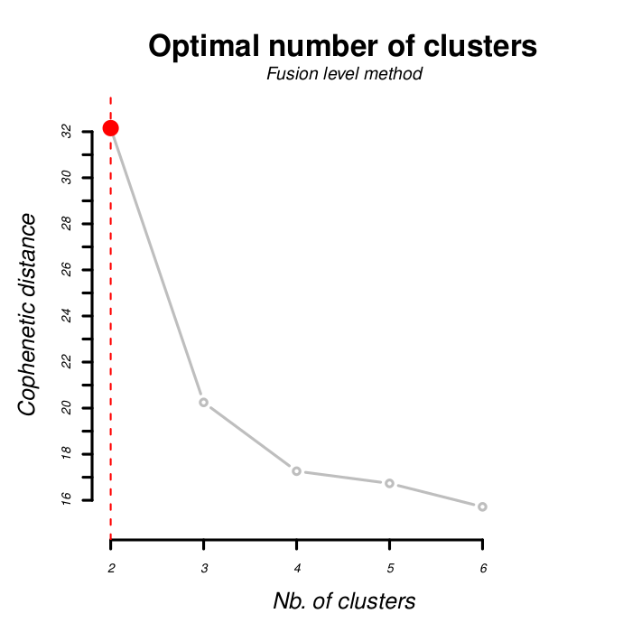
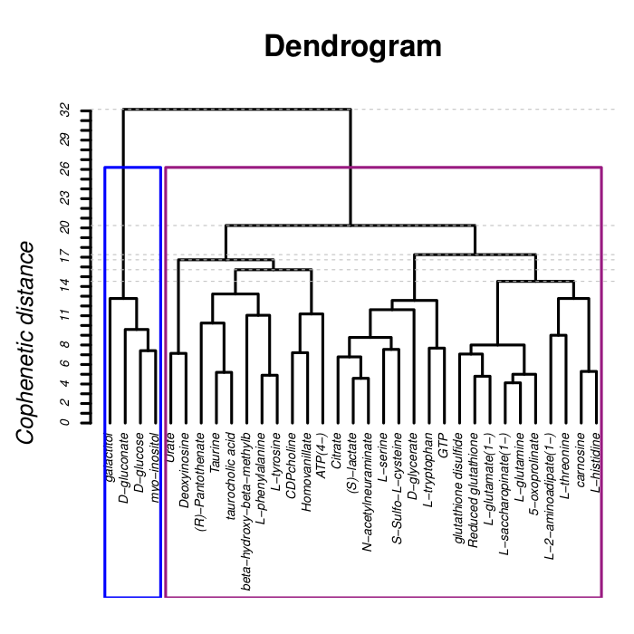
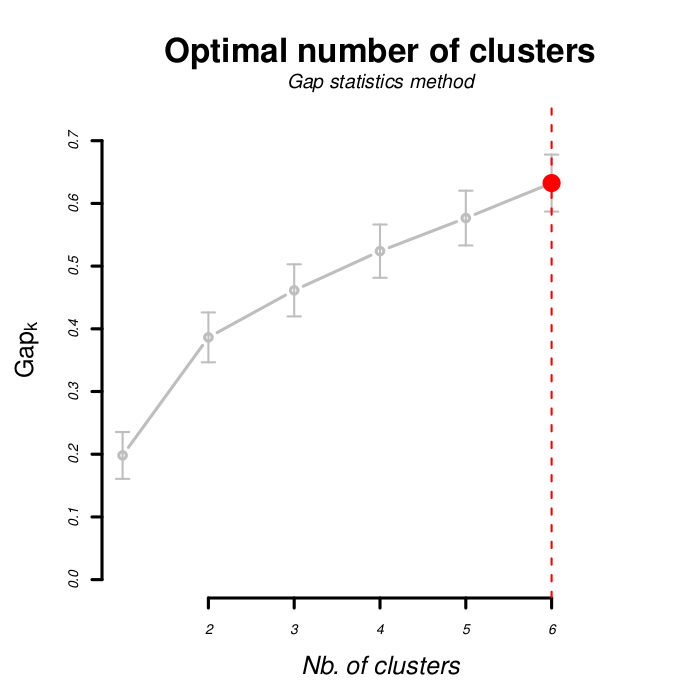

# [Autoclus] - Automatic clustering

Version: 3.1

Performs unsupervised clustering and automatically determine the best number of cluster

## Description
Unsupervised algorithm to classify each individuals (e.g., individuals) in a optimal number of clusters. This optimum is determined automatically by the Silhouette's index (Rousseeuw, 1987). This index is based on: a) the average distance of a point to each points of its cluster, b) the average distance with each points of the closest cluster. For a given partitioning, the average width of the silhouette index is calculated on each s(i) = ( b(i) - a(i) ) / max{ a(i), b(i) }. This index vary from 1 (where the individuals are well fitted in their class) to -1 (where they are closer to another cluster). The best partition is determined by the minimum average silhouette width.

### Input files
- a ```matrix``` (csv or tsv) : the first column should contains the individuals' names, and the other, the variables. Except for the first one, columns with characters values will be discarded from the analysis. "NA" values are not tolerated by the algorithms.  An example dataset can be downloaded [here](inst/extdata/matrix.txt).

### Output files

##### Default mode 

- ```heatmap.pdf``` : distance matrix between individuals colored by a gradient of color (from minimal distance, in red, to maximum distance, in blank). In case of hierarchical clustering, the individuals are ranked according to dendrogram result. In case of clustering by partitioning (or in advanced mode), they are ordered by the Silhouette's score.

- ```average_silhouette.pdf``` : optimal number of clusters according to the average Silhouette's index (x: number of clusters; y: average width of silhouette).

- ```silhouette.pdf``` : for the optimal number of clusters (determined above), the Silhouette's index for each individuals and for each cluster.

- ```pca.pdf``` : individuals projection in the first axis of a PCA. Individuals are colorized according to their belonging to each clusters. Each clusters is represented by a centroid and an elliptical dispersion.

- ```summary.tsv``` : for each partitioning, the between- and the (sum of the) within-inertia, the between-inertia differences with the previous partition, the average silhouette width.

Nb. clusters | Between-inertia (%) | Between-differences (%) | Within-inertia (%) | Silhouette index | Gap | Gap SE
------------ | ------------------- | ----------------------- | ------------------ | ---------------- | --- | ------
2 | 38.11 | 38.11 | 61.88 | 0.45 | 0.38 | 0.039
3 | 48.15 | 10.03 | 51.84 | 0.19 | 0.46 | 0.041

- ```clusters.tsv``` : for each individuals, the name of the individuals (ranked by silhouette's score), the numerical identifier of their cluster, their pca coordinates on the first two axis, their silhouette's index.

Metabolites | Cluster | Silhouette | Axis1 | Axis2
----------- | ------- | ---------- | ----- | -----
Reduced glutathione | 1 | 0.56 | 4.60 | -0.17
L-glutamate(1-) | 1 | 0.56 | 4.67 | 0.92
D-glucose | 2 | 0.62 | -9.03 | -1.34


##### Agglomerative hierachical clustering mode (by default)

- ```shepard_graph.pdf``` : Correlation between the distance matrix and the agglomerative metric used by the AHC. The squarred correlation is the % of variance of the model. This index is always the best for UPGMA and the worst for Ward. 

- ```fusion_levels.pdf``` : Differences in branch height with the next agglomeration step. The optimal number of clusters should be the largest one.
 
- ```dendrogram.pdf``` : Agglomerative tree for all paired combinations and the colored chosen clusters.


##### Advanced mode 

- ```elbow.pdf``` : Optimal number of clusters according to the between inertia loss per partition (x: number of clusters; y: relative within inertia). 

- ```gap_statistics.pdf``` : Best clustering according to the the gap statistics (see below; x: number of clusters; y: within inertia gap). The optimal number of clusters is the greater gap statistic in comparison to the gap statistics from the next partitioning and its standard deviation (Tibshirani et al., 2001). 

- ```log_w_diff.pdf``` : Differences between the within-inertia log from the dataset and from a random bootstrap, also called gap statistics.

- ```contribution.tsv``` : contribution of each columns to the inertia of each clusters for the optimal partitioning.

- ```discriminant_power.tsv``` : contribution of each columns to the inertia of each partitioning.

- ```within.tsv``` : within-inertia of each clusters for each partioning.

Nb. clusters | Cluster 1 | Cluster 2 | Cluster 3
------------ | --------- | --------- | ---------
2 | 0.12 | 0.87 | 
3 | 0.21 | 0.08 | 0.69

## Installation
Required:
- Softwares : R (≥ 3.3.0)
- R libraries : see the [DESCRIPTION](DESCRIPTION) file.

### Windows & Mac
Click on the green button in the upper right corner ```Clone and Download``` and then ```Download the ZIP```. Extract the file. After installing [Rstudio](https://www.rstudio.com/products/rstudio/download/#download), in the upper menu, go to "Tools", "Install packages" and select "install from: package archive file" and select your downloaded file.

### Linux
```
devtools::install_github("ecamenen/autoCluster")
```

## Launch the app
In RStudio, execute:
```
autoCluster::run_app()
```

Or open ```app.R```. Then, the application could be launched by clicking on the ```Run App button``` in the upper right corner of the script menu bar.

## Command line interface
For direct usage :

```
Rscript launcher.R -i <input_file>
```

With optional parameters :

```
Rscript launcher.R --infile <input_file> [--help] [--verbose] [--quiet] [--header] [--separator <separator_charachter>] [--classifType <classif_algorithm_ID>] [--distance <distance_type_ID>] [--maxClusters <maximum_clusters_number] [--nbClusters clusters_numbers] [--nbAxis <axis_number>] [--advanced]
```

##### Execution parameters
- ```-h (--help)``` print the help.
- ```-v (--verbose)``` activates "super verbose" mode (to survey long run with big data; specify ongoing step).
- ```-q (--quiet)``` activates a "quiet" mode (with almost no printing information).


##### Files parameters
- ```-i (--infile)```(STRING) [REQUIRED] specify the path to the inputs files (dataset of fingerprint).
- ```-H (--header)``` considers first row as header of the columns.
- ```-s (--separator)``` (INTEGER) specify the character used to separate the column in the fingerprint dataset (1: tabulation, 2: semicolon) (by default, tabulation).


##### Clustering parameters
- ```-t (--classifType)``` (INTEGER) type of clustering algorithm among clustering by partition (1: K-medoids 2: K-means) and ascendant hierarchical clustering (3: Ward; 4: Complete links; 5: Single links; 6: UPGMA; 7: WPGMA; 8: WPGMC; 9: UPGMC). By default, the complete links is used.
- ```-d (--distance)``` (INTEGER) type of distance among 1: Euclidian, 2: Manhattan, 3: Jaccard, 4: Sokal & Michener, 5 Sorensen (Dice), 6: Ochiai. By default, euclidean distance is used.
- ```-m (--maxClusters)``` (INTEGER) number maximum of clusters allowed; by default, 6 clusters (mimimum: 2; maximum: number of row of the dataset).
- ```-n (--nbClusters)``` (INTEGER) fixed the number of clustering in output (do not take account of Silhouette index; mimimum: 2; maximum: number of row of the dataset).
- ```-N (--nbAxis)``` (INTEGER) number of axis for PCA analysis outputs; by default, 2 axis (minimum: 2; maximum: 4).
- ```-a (--advanced mode)``` activates advanced mode with more clustering indexes: gap statistics, elbow, agglomerative coefficient, silhouette index and pca first 2 axis for each points. The heatmap will be ordered by silhouette index.


## References
- Rousseeuw, P. J. (1987). Silhouettes: a graphical aid to the interpretation and validation of cluster analysis. Journal of computational and applied mathematics, 20, 53-65.
- Tibshirani, R., Walther, G., & Hastie, T. (2001). Estimating the number of clusters in a data set via the gap statistic. Journal of the Royal Statistical Society: Series B (Statistical Methodology), 63(2), 411-423.